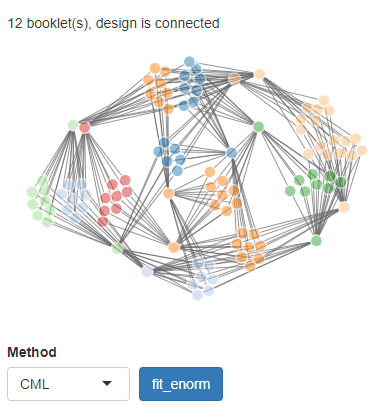

<style>img{border:none;}</style>


```{r setup, include=FALSE, message=FALSE, warning=FALSE}
library(knitr)
library(dplyr)
library(dexter)

opts_chunk$set(echo = FALSE,dev='CairoPNG')
```

**Dextergui** provides a graphical user interface to the main functionality of dexter, a package for analysis of educational tests. You can start it from the R(studio) console in the following way:

```{r, eval=FALSE, echo=TRUE}
library(dextergui)
dextergui()

```


With dextergui you can:

* manage test data in a reasonably clean way
* evaluate quality of tests and items with classical test theory
* use IRT analysis to compute comparable ability scores for respondents who took different test versions
* compare ability scores between groups of persons

Below we give a brief tour of dextergui. The navigation bar at the top of the page lets you switch between the main components of dexter. We'll start on the *project* tab.


The easiest way to familiarize yourself with dextergui is to open an example project, e.g. the verbal aggression dataset, by clicking on _example datasets_ and then choose _verbal aggression_. This is a rich one booklet dataset with person and item properties and ideal for exploring the gui.


## Start or open a project

Dexter organizes test data in projects. Projects are miniature databases that are saved in a .Sqlite file and contain all your project data, including but not limited to e.g. items, scoring rules and response data. On the project overview page you can start a new project, open an existing project or browse through an example project. Example project datasets are taken from the packages *dexter*, *psych*, *sirt* and *MLCIRTwithin* if installed. 


All projects created in *dexter* or *dextergui* can be opened with the *open project* button. For now we will focus on starting a new project. When you click *start new project* you will be asked where to save it. To fill your project with data, you have to take two more steps:

### Add scoring rules

After starting a new project you have to import a scoring rules file. This is because dexter needs to know the scores for every permissible response for each item. 


The scoring rules file is an excel or csv file and can have on of two formats

 * columns: *item_id, response, item_score*, listing all items and possible responses.
 * columns: *item_id, nOptions and key*. Keys can be either alphabetical or numeric.

In both cases the first row must contain the exact column names. Below you see examples of the two formats.

<div style="text-align:center"><div style = "display:inline-block;vertical-align:top;margin: 0 2em 0 2em;">

```{r, echo=FALSE, message=FALSE, warning=FALSE}


data.frame(item_id = c('S1DoCurse', 'S1DoScold'), response = c(0,0,1,1,2,2), item_score = c(0,0,1,1,2,2)) %>%
  arrange(item_id, response) %>%
  kable(caption='Standard format, suitable for polytomous and mc items')

```

</div><div style = "display:inline-block;vertical-align:top;margin: 0 2em 0 2em;">

```{r, echo=FALSE, out.extra='style="float:left;"'}

data.frame(item_id = c('mcItem_1', 'mcItem_2','mcItem_3'), nOptions = c(3,4,3), key=c('C','A','A')) %>%
  kable(caption='Alternative format, only suitable for mc items')

```

</div></div>

If you have open ended items, these can be accommodated by scoring them before importing. The column *response*  should in that case be equal to the column *item_score* (i.e. response 0 gets score 0, response 3 gets score 3 and so on). 

After selecting a file, dexter will show a preview of the rules. If all looks ok, you should press *Import* to import the scoring rules.

### Import response data

Once you have imported the rules, the next step is to import response data. 
To import response data, select the *Data import* tab in the navigation bar on top of the page.


Response data is imported one booklet at a time. First provide a unique name for the booklet or testform in the field *booklet id*. Next use the *Browse* button to select a file with response data. This file can be in excel or csv format and the first row must contain column names. 

The column names should be item id's which each have an exact match to the item id's in your scoring rules, note that capitalization matters. You can also include person properties like grade or study program. It is also good practice (but not mandatory) to include a column <i>person_id</i> with a unique identification of each person in your data. Each row in your data, apart from the column names, should represent a single person like in the example below. 

```{r, echo=FALSE}
verbAggrData[1:8,1:8] %>%
  kable(caption="example response data for the verbal aggression dataset (Vansteelandt, 2000)")
```


When you select a file, dexter shows a preview of the response data. Any column with a name that doesn't match a known item id will be ignored by default. You can import such columns as person properties by clicking the corresponding buttons.

<table class="table shiny-table table- spacing-s" style="width:auto;">
<caption align="top"> Response data preview </caption>
<thead> <tr> <th style="text-align: left;"> column </th> <th style="text-align: left;"> import as </th> <th style="text-align: left;">  </th> <th style="text-align: left;"> values </th>  </tr> </thead> <tbody>
  <tr> <td> Gender </td> <td> ignored </td> <td> <button type="button">add as person property</button> </td> <td> Male, Female, Female, Female, Female, Female, Female, Female, Female, Female, ... </td> </tr>
  <tr> <td> S1DoCurse </td> <td> item </td> <td>  </td> <td> 1, 1, 0, 2, 0, 2, 0, 1, 1, 1, ... </td> </tr>
  <tr> <td> S1DoScold </td> <td> item </td> <td>  </td> <td> 0, 2, 0, 0, 0, 2, 1, 1, 0, 0, ... </td> </tr>
  <tr> <td> S1DoShout </td> <td> item </td> <td>  </td> <td> 1, 1, 0, 0, 0, 0, 0, 0, 0, 2, ... </td> </tr>
  <tr> <td> S1WantCurse </td> <td> item </td> <td>  </td> <td> 0, 2, 1, 2, 0, 0, 2, 2, 1, 0, ... </td> </tr>
  <tr> <td> S1WantScold </td> <td> item </td> <td>  </td> <td> 0, 2, 0, 2, 1, 2, 2, 2, 0, 0, ... </td> </tr>
   </tbody> </table>


If the preview looks all right you can import the response data by pressing the import button.


## Classical analysis


In the *classical analysis* tab you will find two further tabs, *booklets* and *items*. 


### Booklets

The booklets tab shows a table of classical statistics per booklet and plots of the item total regressions.

```{r, include=FALSE, message=FALSE}
db = start_new_project(verbAggrRules,':memory:', person_properties=list(gender='NA'))
add_item_properties(db, verbAggrProperties)
add_booklet(db, verbAggrData, "agg")
tia=tia_tables(db)
```

```{r}
tia$booklets %>%
  mutate_if(is.double, round, digits=3) %>%
  kable()
```

```{r, fig.width=5, fig.height=5}
f=fit_inter(db)
plot(f, "S1DoScold", show.observed=TRUE)
```

The plot shows regressions based on two models: the interaction model is shown with a thicker but lighter line, and the Extended Rasch model is shown with a thinner, darker line. The unsmoothed data is shown as red dots. The *curtains* are drawn at the 5% lowest and the 5% highest sum scores. This can all be adjusted with the input fields on top of the plot.

The Rasch model fits this item very well, so the two curves practically coincide. This need not be always the case. The interaction model is quite interesting for practice. It shares the conditioning properties of the Rasch model, which means that we can predict the expected item score at each observed total score. Hence, we have the possibility to represent the model and the observed data on the same plot, without tricks or circular reasoning. This makes the interaction model a very useful tool to evaluate the fit of the Rasch or Extended Nominal.


### Items

The items tab shows classical statistics for the items on the left, including RiT, RiR and pvalue.

```{r}
tia$items %>%
  slice(1:10) %>%
  mutate_if(is.double, round, digits=3) %>%
  kable()
```


**The distractor plot** on the right shows a non-parametric regression for each response on the test score. In this case a multiple choice item which obviously has poor distractors. 


**Note:** if you spot a key error, the table of responses right under the distractor plot allows you to change the score for a response by clicking on the respective score and changing it.


## Subgroup analysis

How do different (groups of) persons achieve the same test score? To answer this question you need to first define person properties and item properties in your data. Then you can make a profile plot (on a per booklet basis).

This plot of the verbal aggression set (see the included examples), shows that, controlled for the same overall verbal aggression test score, Women tend to Shout more and Men tend to Curse and Scold more (Men tend to be more verbally aggressive than Women overall, so it is not true to say that Women tend to shout more in general).


```{r,fig.width=5,fig.height=5,results='hide'}
get_items(db) %>%
  mutate(behavior2=if_else(behavior %in% c('Curse','Scold'),'Curse,Scold',behavior)) %>%
  add_item_properties(db,.)

profile_plot(db, item_property='behavior2', covariate='gender',x='Curse,Scold',main='behavior')

```

There is also a test for DIF at the item-pair level.

## Item Response Theory


In this tab you can fit an IRT model using Conditional Maximum Likelihood or a Gibbs sampler (Bayesian analysis). For this you need a connected design (i.e. your booklets must contain overlapping items). This is shown in the network plot below.



Clicking the button **fit_enorm** will fit the Extended Nominal Response Model, which is a polytomous Rasch model where the scores for each response can have any integer value.

Once you have estimated a model you can use it in several ways with the tabs below.


### Abilities & Plausible Values

When you have calibrated your model dexter can compute ability estimates for each person. You have a choice of using a Maximum Likelihood Estimate (MLE) or an Expected a Priori (EAP) estimate with choice of a Jeffreys or a normal prior. 

Plausible values are random samples from the posterior distribution of ability. They are closer to the true distribution of ability in the population than straightforward ability estimates. Plausible values are continuous, as opposed to ability estimates which are granular because of the discrete nature of test scores. Therefore the distribution is much smoother.

There is an extremely rich selection of plots to see how ability is distributed in your population(s). Enriching your data with person properties (see the projects tab) will let you make the most of these. You can also view or download the estimated abilities per person.

{width=75%}


### Score-ability tables

Score-ability tables lets you compute a score-to-ability transformation table for each booklet. This is often desirable, e.g. for automatic systems or score transformation tables supplied with paper tests for scoring by teachers.

### Items

After you have fitted a model, the item tabs shows the estimated parameters and a graphical item fit measure. 

## Learn more

The extensive [online documentation for dexter](https://dexter-psychometrics.github.io/dexter/) shows how to do many of the things you can do in the GUI in the R console and explains much more about plausible values, profile plot, DIF and much more. 

## Issues

If you have **problems downloading images and data**, the solution is to open the application in a browser (use the *open in browser* button on the top of the screen). Best results are achieved with the *Chrome* browser, although most others work fine. The exception is currently Microsoft Edge, in which the application does not work very well yet.

If you have another question, encounter a bug or would like to request a feature, please tell us about it on https://github.com/dexter-psychometrics/dexter/issues . 


```{r, include=FALSE}
close_project(db)
```
